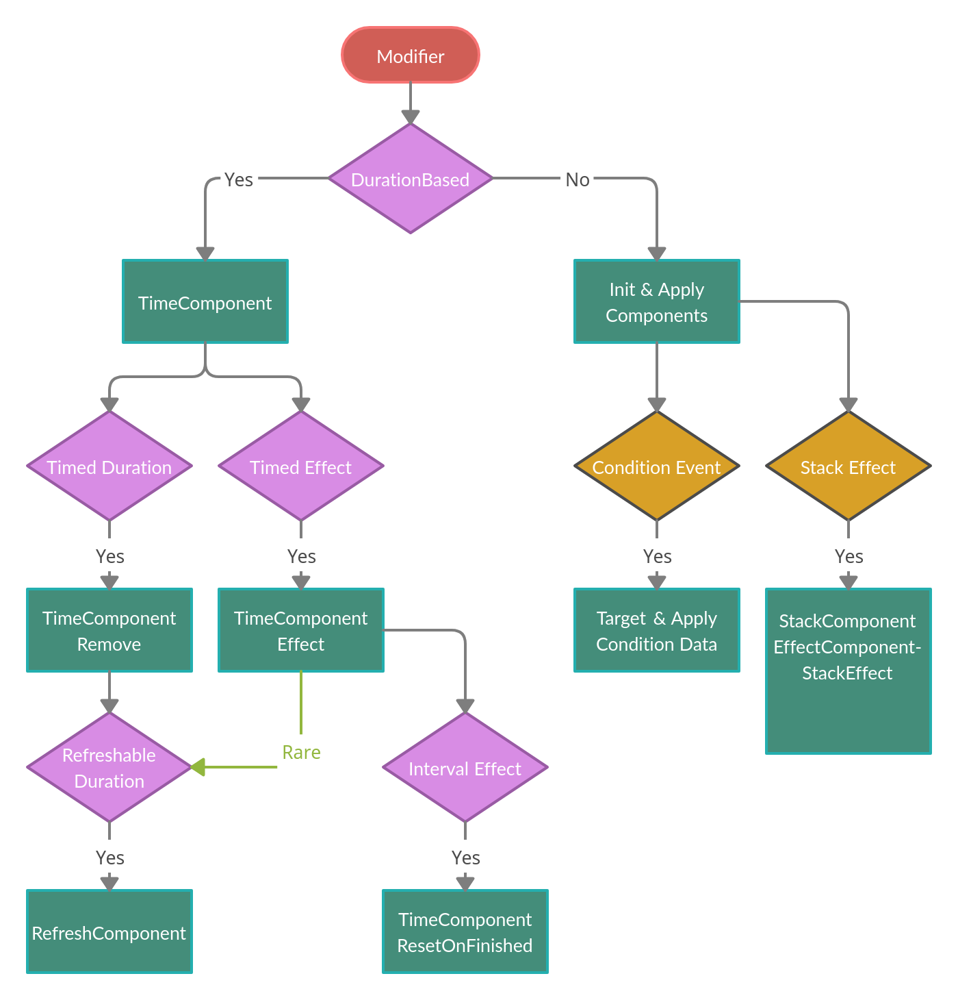
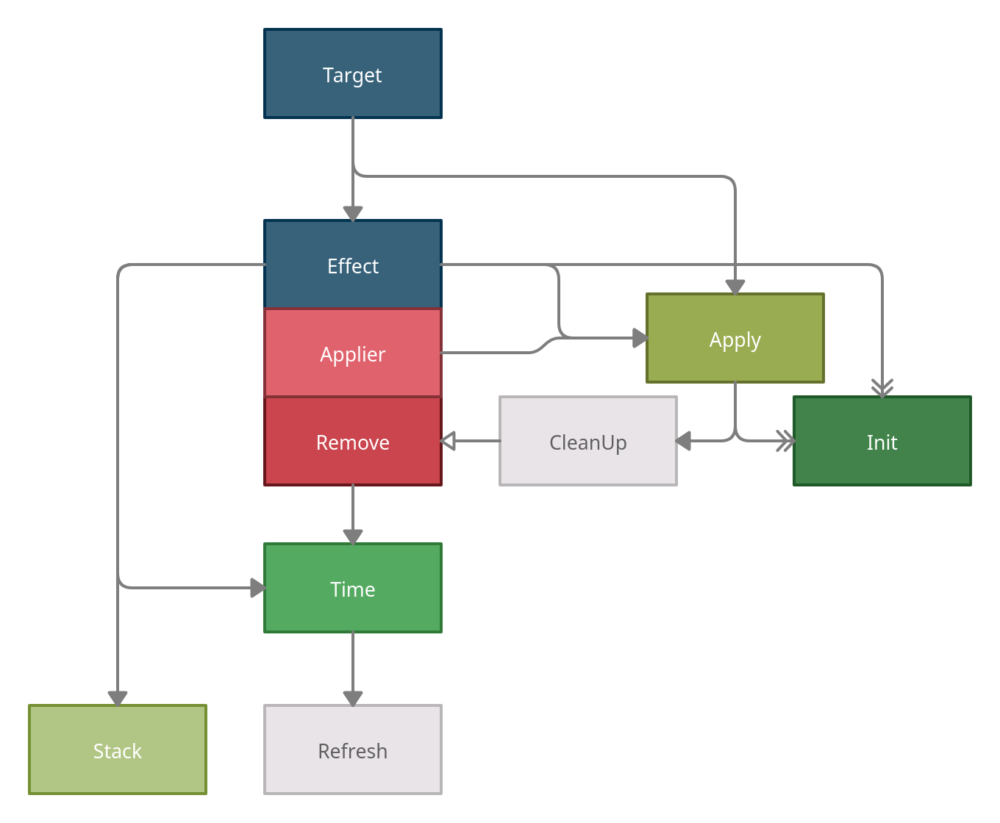

# Terms

| Term             | Explanation                                                                                                                        |
|------------------|------------------------------------------------------------------------------------------------------------------------------------|
| StatusResistance | Resistance for any kind of status: elemental damage, elemental data, DoT, duration, negative debuffs, etc.                         |
| StatusTag        | Tag for all types of statuses: elemental damage, elemental data, DoT, duration, negative debuffs, etc.                             |
| DamageData       | Holds damage values, DamageType, and ElementalData                                                                                 |
| ElementData      | Holds type and effectData of elements. Ex: Fireball, Fire, 10 effect, 10 linger                                                    |
| DamageResistance | DamageType and ElementalType resistances: Physical, Magical, Pure, and, Acid, Cold, Fire.                                          |
| **ModifierSystem**|                                                                                                                                   |
| Modifier         | Buff/Debuff on beings, can do anything, slow, over time/delayed stun, change stats, deal damage, resurrect                         |
| ModifierApplier  | A special modifier that applies another modifier on someone by either cast or attack                                               |
| ComboModifier    | Special Modifier that is activated on specific conditions (recipes), these can be: specific modifiers (ID), ElementalData or Stats |
| ComboRecipe      | Recipe (condition) for a ComboModifier to be added, possible conditions: specific modifiers (ID), ElementalData or Stats           |

# Rules/Ways of doing stuff
Only components that should be initiated directly into modifier:
* init
* timeEffect
* stack
* refresh

## Creating a new modifier

## What interacts with what, component relations?   
Blue = Needed  
Green = One Needed (holder of Effect), darker green = more common  
Red = Different types of Effect  
White = Optional  
Blank arrow = Optional  
Double arrow = Params  

Must have: Target, Effect    
One of: Init/Time/Apply/Stack  
Optional: CleanUp, Stack, Refresh  

Direct Order:  
Modifier, Data,  
Target, Effect, Apply, Init, CleanUp, Remove, Time, Stack, Refresh  

**Ideal order**:  
Modifier, Data.  
Target, Effect, Apply, CleanUp, Remove, TimeRemove.  
Init, TimeEffect, Stack, Refresh   

Making a modifier decision flow chart:  
* Duration based
  * TimeComponentEffect
  * Refreshable duration
    * RefreshComponent
* Finite duration
  * TimeComponentRemove
* OnStart/Init
  * Apply & Init
* StackableEffect
  * StackComponent
ConditonBased

Applier

# Design questions
* EffectStacking, with Value changing. Ex. DamageRes, stacking. Makes it so we can't easily revert if atter the buff is gone. Aka we can't feed stacks values to revertEffect in a clean way 
* ApplyAttackModifiers iteration, needs a copy, beceause attacking might lead to a new modifier being added. Have a separate list of keys of appliers?
    Or make new logic that ads the modifier after we have fully iterated through it (might not be ideal).
* We have to deep clone effect in EffectPropertyInfo so it can be reused without multiple targets holding the same effect, and overwriting each other
    Not ideal, best to have some sort of data-only in Properties, and then make a new effect class here.
    Problem with that, is that we'll need to make a new effect using reflection?
    Or a centralized method to make new effects, that needs to be updated for each new effect... Both, bad solutions...
* Either all buffs need to be refreshable, or we need a special check if something is a buff effect, to not apply it again on init
* First being events have priority rn over all the other ones, so their calls will take over other events counters, ex, AttackEvent heal 1 health, will take over next event that is ex. HitEvent heal 100 health
  * We could maybe set some sort of priority to all events? Or give everyone a fair shot/fair deal instead of limiting every event?
* How to check for ConditionCheck applies? Through a special timeComponent logic? That checks every X, if true, effect. If effect passed, wait. Better than OnDamagedEvent and such?
* In EffectComponent, should be pass _targetComponent.Owner as acter instead of null? We might want to check owner, when its a normal non-condition effect? At some point.
* CleanUpComponent only needed when we have remove? Automated with apply otherwise?
* What more mechanics can refreshComponent have?
* Single/X use condition modifiers, how? RemoveComponent can hold X stacks, lowering down to 0, then actual effect is triggered
* Should CleanUp remove buffs/upgrades, ex. on kill. We would need to record the amount, or store it in a different way
* Order of BaseBeing.Update() and ModifierController.Update() matters for StatusEffect
* More efficient way of saving timer data related to enum/id (not dict? but array of some sort?)
* OnStatChange ComboModifierRecipe check, how? We don't have a generic function for all stat changes where we could check for combos
* Removing all modifiers from ModifierController wont remove the parmanent buffs & debuffs, make a function that does the opposite for these?
* What to do with Positive/Negative status tags, how to automate positive? Check for positive value on stats, buffs, etc?
* Should appliers be allowed for conditional? Most probably yes, like applying poison modifier on getting hit
* We might come into trouble with multiple target components, since rn we rely on having only one in modifier

## Design solutions
* Recursion problem, when a condition event is triggered, there's a chance it will be triggered again by the same call. Disabling them fully is kinda uncool, since it makes some nice interactions impossible
  * BaseBeingEventController. Whenever we go through code controller tells us when to trigger event

# Modifier

Process (lifecycle):  
    Modifier tries to be added to entity collection  
    We check for duplicates, refresh, stack, etc.  
    When added, apply may be called (ex. on init buff)  
    Update all updatable components in collection (ex. TimeComponent)  
    Apply components check for validity of apply  
    if passed: Trigger EffectComponents  
    Either triggers an effect, or removes modifier after duration passed

Technical lifecycle:  
    ModifierManager.AddModifier(modifier)  
    ModifierManager.CheckDuplicate(modifier)  
    Stack or Refresh  
    If targetself, setTarget(self)  
    modifier.Init()  
    May modifier.Apply()  
    Update TimeComponent  
    May modifier.Apply()  
    After linger/duration remove ModifierManage.RemoveModifier(modifier)

Figure out order of operations:  
    Attack  
    GetApplierMods  
    SetTarget of ApplierMods  
    Apply (effect) applier Mods  
    Set target before applying (& Effect())

Linger makes it so "fast spells" dont do their effect, because modifier is already present  
    Solution: make a class for status effects in Being, instead of having a linger for combos.
        But then we can't combo based of present modifier IDs
    Solution 2: //If we didnt stack or refresh, then apply internal modifier effect again? Any issues? We could limit this with a flag/component
        if(!stacked && !refreshed)
            internalModifier.Init();//Problem comes here, since the effect might not actually be in Init()

## Modifier Design Process

Designinger a modifier: Strong direct specific upside rolled to a significant amount and a strong downside that should be always somehow related to the upside
, ex: 1.5x attack speed, hp lowered by 30-50%.
, bad ex: 1.1x attack speed, spell casting speed lowered by 10% (we don't care for spell cast speed if we're attacks-only build, aka straight buff)
Modifier ideas:  
X can be: damage, speed, stat, health, mana, etc

## ComboModifier

How do cooldowns?
  Dict of added comboMods in ModController, ticking downwith time (updating values every second)
  Remove ID from dict/hashset on 0

When should we check for combo modifiers to add?  
    OnAddModifier  
    & every 1 second & on adding elementalData?  
    & every 1 second & on stat change?  

ComboMod ConditionalRemove, timer starts ticking down after condition isnt met anymore? (Might be better to just have a time remove, and comboMod is added again later, or we refresh the duration when it tries to be added again)  

Should ComboModifier be applied again?/What happens when there's a duplicate?  
ComboModifier multiple recipes.  
Statbased comboModifier, when health is bigger than 10k, "massive" comboModifier (best to make another condition, so it's more unique, and not every enemy after level X has it...)  

ComboModifiers concept  
    What does combomodifier need that's different from modifier?  
    Should ComboModifier be a separate class in general? Since it might not have enough of the same mechanics?  
        Activation conditions  
        Cooldown (so the combomodifier can only be triggered X often (aka damage isn't spammed by mixing fire & preasured gass to make an explosion every attack))  
    Combo examples:  
        Explosion (fire & preasured gass)  
ComboCondition backend:  
    OnAddModifier check for combinations  
    Possible things to check for:  
        Enough elemental attacks lingering/on being (elemental value that goes down over time?)  
        Specific Modifiers (IDs)  

## Components

Component based system (mixing components to a new modifier, like a recipe):  
Components needed:  
    Effect  
    Target (makes sure Target(s) is valid)  
Component types (-Component):  
* Init  
* Apply  
  * Simple apply, no rules, just call effect  
  * Conditional apply, when effect is triggered & a conditional value is true  
* Time   
* Stack  
* Refresh  
* Remove  
* CleanUp  
Non-Technical:
* Graphics
* Sound
* ParticleEffect

    

### TimeComponent

### Stack-RefreshComponent prototype problem

Whats the issue?  
We're using the prototype pattern, so we need to clone every element of the modifier & being.  
We also need to clone StackComponent, and the behaviour it should have on stack.  
That cloned behaviour should now point to the new cloned effect, we can't use delegates, unless we pass the object directly into them & don't ref anything "new"  
So, save behaviour, but without inheritance & delegates.  

Now, how does one define complex behaviour? We have to hardcode it in the class

Pass in the reference, and use it as action

MetaEffect, that changes an IEffectComponent

Hey everyone, design problem here.

I want a very "generic"/open delegate like "Action". So it can be used in a lot of ways, like incrementing X and Y.  
But also doing X effect on Y count. So limiting the behaviour is very not ideal, aka hardcoding the cases.  
Now, the problem is, the prototype pattern. Im using it with deep cloning the entire object.  
This is fine, until we try to clone the "Action", we can clone it to be the same. But then:  
1. Our target will be wrong (old).  
2. I don't want to hardcore the Action data in the class, since it can be a lot of different things.  

Another possibility is that.  
I might be going about this the wrong way. Maybe there's an elegant way of doing this open-ended behaviour.  
Without using delegates, and a lot of hard-coding the behaviours in the class.  

### StackComponent

What can a stack do?  
* Increase numbers (damage, speed, TimeComponent.duration)  
* Trigger an effect on X stacks  
* Trigger an effect every X stacks
* X stacks amount * Y Value (ex. damage)

### RefreshComponent

RefreshComponent is also fairly complex, cuz it's still tricky on how to make it proper, should refresh only refresh timer duration? If so then it's useless  
    since we can refresh directly through timerComponent (but then we'll need to know which one to refresh, so maybe not?)  
RefreshComponent:  
    refresh duration  
    & increase duration  
    & trigger effect

# Elemental Data

When should elemental damage be applied? DealDamage?  
When should elementalData be applied, that's not damage? OnAddModifier?  

Element example, fire:  
    effectValue = general strongness, ligeringValue = for how long it stays  
    Fireball = 20 effectValue, ligeringValue = 10  
    Flamethrower = 10 effectValue, ligeringValue = 20  
    Firestorm = 60 effectValue, ligeringValue = 20  
    Meteor = 150 effectValue, ligeringValue = 50  
    Fire of a small star = 1000 effectValue, ligeringValue = 100  
    Fire of middle of a star = 5000 effectValue, ligeringValue = 300  

# Status Resistances
 * Stun, DoT, Slow, Specific Buff/Debuff (resistance, elemental, etc)
 * Elemental based: Poison DoT, Fire DoT
 * DamageType based: Physical, Magical
 * Positive/Negative based (might be redundant, since we have StatusType? So "Negative" is already there, what about positive?)
 
When to check for status resistance changes?
Obvs, when they change. So when one goes to zero, we should update. And when "ChangeStatusEffect" gets called

Maybe a more proper "Tag based" system? To have one big enum that defines all possibilities  
Let's skip the combinations like: Fire DoT, etc. And have it be focused on only one  
Ok so, how does one do positive status resistance then? We divide instead... Ez Clap  

Value=>  
Percentage  
Recalculate on Add&Remove

Process:  
    Add status resistance to the collection  
    We hold Values & percentages of every statusType  
    Ex: Add FireRes 80%, Add FireDoTRes 80%  
    => FireRes 80%, Fire DoT 64%  
    Then the timer asks/ticks whatever:  
    Im a Negative, Fire DoT modifier, what should be my length?  
    He takes multipliers of: FireRes, Negative, DoT  

Divide status res when increasing? (positive)
  
# Ideas

Different types of lifesteal:  
Based on damage dealt (done)  
Based on damage dealt before resistance reduction (done)  
Based on enemy's current/max health %

DOT res - No spellcasting or Attacking
100% status resistance/elemental resistance - downside

When lower than X health do Y  
Heal damage instead of getting damaged for 3 seconds  
Stack More damage every instance  
More damage every missing X (mana, health, lower level than hero)  
Take control over enemy creep for X seconds  
When attacked do X  
When attacked by X damage do Y, then reset damage count  
Cant attack, cant be attacked. (Nightmare)  
Reduced regen (healing, mana, etc)  
More float X or X% with missing health/mana/etc (huskar)  
Thorns  
    Before reduction, After reduction, Flat damage thorns
On kill enemies "Explode" dealing damage (can be comboed with, explode, dealing hp as dmg?) Would be a cool combo modifier  
The more damage you deal to yourself, the stronger your attacks are  
Every X attack do Y  
Every X cast do Y  
For every nearby enemy, do more X  
More X for every missing hp/mana on enemies/allies  
Backstab  
Bristleback  
Remove 30% of enemies health, but do the same to your hero  
IO link (healing, mana)  
Asborb X damage  
Counterattack % on attacked  
Lifesteal  
Lifesteal %current health  
Reduce forwards physical attacks (mars)  
More X at day/night  
For every kill gain X permanent stat  
Fast attacks, 70% lower damage  
Physical damage block  
Lower enemies physical damage %  
Reduce enemy stat(s) for X seconds  
Linked beings, if one dies, so does the other. Buff each other  
Glaive bounces  
Mana shield  
Health is mana, mana is health  
Invis?  
Morph into enemy, gain 1-2 of his spells (might be bad)  
Mana burn  
Reflect one damage instance
Crit  
On attack X chance to spawn illu  
Link (razor)  
Souls (SF)  
Steal attributes/stats for X duration on X  
Spectre E  
Refractions (TA)  
Every hit deal more damage (Ursa)  
Lower regen health/mana/etc by 70-90% with X duration  
More damage based on distance  
Binds two targets, every target spell gets applied to both.  
Warlock binds Q  
Cooldown reduction  
Rupture  (damage while moving/doing actions)  
OnHeal = they heal you back
OnHealed = you heal them back
OnHealed = attack them (might be an interesting downside-mod)
Stun every time you get damaged for 0.2 seconds, cooldown 0.3-0.4 seconds (cold snap)
For every damage taken, take 50% of that damage again 10 seconds later (Maledict)
For every elementalData do/buff X
For every elementalData with intensity do/buff X

## Game interaction/mechanics ideas
Web (flamable, modifier/combo makes it immune to flames/makes it out of flames)  
Spawning spiders (on cast, kill, whatever). Buffing them instead of yourself  
All buffs are doubled, but don't work on you anymore.  
Self-buffs work/are applied on your allies as well, but all buffs effect is lowered by 80-90%.  
Your lifesteal is shared between allies, but you can't lifesteal anymore.  
Infest:   
* On kill spawn spider  
* Infest a creature into an enemy, killing them slowly from the inside (ignores resistances). Can't be applied to non-biological forms?    
For each spell cast (by anyone) do/buff X  
	
### Interactions list

#### Positives
Shares lifesteal with allies, but...
Nullify enemy X resistances/elemental data, but... (deal no damage?)

#### Negatives
Can't heal, but...
Can't lifesteal, but...
Can't cast spells, but...

#### Neutral
Allies share health, but...
Allies share mana, but...
Enemies share X resistance(s), but...

## Combo mod ideas

Remove all base resistances & armor  
Stop "time" for X seconds  
When close to dying, shadow grave, duration based on skill cooldown.  
Anti perma-stun  
Massive amounts of mana = Mana Giant/Golem